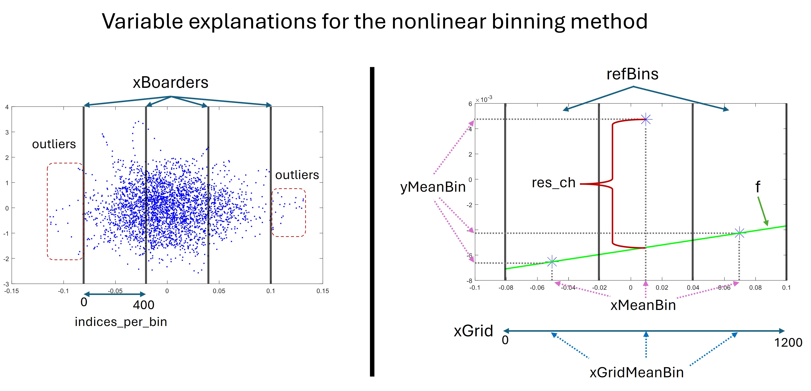

# NonlinearCompensationEEG

This repository contains the implementation of the method presented in article "Improving Tracking of Selective Attention in Hearing Aid Users: The role of Noise Reduction and Nonlinearity Compensation" [2].

#  Abstract
Hearing impairment (HI) disrupts social interaction by hindering the ability to follow conversations in noisy environments. While hearing aids (HAs) with noise reduction (NR) partially address this, the ``cocktail-party problem'' persists, where individuals struggle to attend to specific voices amidst background noise. This study investigated how NR and an advanced signal processing method for compensating for nonlinearities in EEG signals can improve neural speech processing in HI listeners. Participants wore hearing aids with NR, either activated or deactivated, while focusing on target speech amidst competing masker speech and background noise. Analysis focused on temporal response functions to assess neural tracking of relevant target and masker speech. Results revealed enhanced neural responses (N1 and P2) to target speech, particularly in frontal and central scalp regions, when NR was activated. Additionally, a novel method compensated for nonlinearities in EEG data, leading to improved signal-to-noise ratio (SNR) and potentially revealing more precise neural tracking of relevant speech. This effect was most prominent in the left-frontal scalp region. Importantly, NR activation significantly improved the effectiveness of this method, leading to stronger responses and reduced variance in EEG data and potentially revealing more precise neural tracking of relevant speech. This study provides valuable insights into the neural mechanisms underlying NR benefits and introduces a promising EEG analysis approach sensitive to NR effects, paving the way for potential improvements in HAs.

#  Data
There are ethical restrictions on sharing the data set. The consent given by participants at the outset of this study did not explicitly detail sharing of the data in any format; this limitation is keeping with EU General Data Protection Regulation, and is imposed by the Research Ethics Committees of the Capital Region in the country it was collected. Due to this regulation, and the way data was collected with a low number of participants where it is not possible to fully anonymize the dataset, it is not possible for us to share the dataset. Data requests can be sent to a non-author at clni@eriksholm.com.

This repository contains the following data:
* `EEG.mat` - EEG data from one trial to illustrate the binning-based nonlinearity detection and compensation method.
* `data.mat`:
  * `TRFdata` - from Eelbrain boosting algorithm in Python.
  * `channelGroups` - information about the 6 channel groups (left temporal, frontal, right temporal, central, parietal, occipital).
  * `snr` - snr values from the original and the compensated EEG data.
  * `compensationData` - TRFs and information of the compensated EEG data (after the nonlinear compensation method has been used).
  * `rawResiduals` - measure of nonlinearity for all conditions, subjects, trials and channels (part of the nonlinear compensation method).
  * `residuals` - measure of nonlinearity average across trials (for each condition, subject and channel).
  * `behaviouralData` - the subjects' answers to the two-choise questions about the target speech, presented after each trial.
  * `labels` - channel labels.
* `significanceData_author.mat` - Results by the author from Fieldtrip's permutation test based on t-statistics. Averaged across all channels.
* `significanceData_chGroups_author.mat` - Results by the author from Fieldtrip's permutation test based on t-statistics. Average within each channel group.
* `simDelay_data1.wav` and `simDelay_data2.wav` - audio recordings in the experimental setup, for computations of time delays in the stimulus.

#  Code overview

The repository contains two main Matlab scripts:

* `main_BinningMethod.m` - Illustration of the nonlinear compensation and detection method (Figure 2 in [2]). Explanation of the variables used in the method is provided in the figure below.

*  `main_Plotting.m` - Plotting scripts for Figures 4-10 in [2].

Help functions are provided in the folder `helpFunctions`.

Function to plot topographical maps of the head are provided in `plot_topography`, by [3].

Configuration settings are stored in `config.json`:

* `fieldtripdir = ""` Add path to Fieldtrip directory.
* `saveFolder = ""` Add path to where figures will be saved. 
* `nBins = 3` Number of bins used in the nonlinear compensation and detection method.
* `nOutliers = 20` Number of outliers in the nonlinear compensation and detection method.
* `indices_per_bin = 400` Number of indices in each bin in the nonlinear compensation and detection method.
* `figPosition` Figure position.
* `numrandomization = 1000` User-specific number of random draws (Fieldtrip's permutation test based on t-statistics).
* `conditions = ["Ton","Mon","Toff","Moff"]` Target NRon, Masker NRon, Target NRoff, Masker NRoff.
* `minnbchan` Minimum number of neighborhodd channels (Fieldtrip's permutation test based on t-statistics).
* `computeSignificance = false` Perform the permutation test based on t-statistics (true) or use the pre-computed statistics by the author (false).
* `saveFigures = false` Save figures (true) or do not save figures (false).
* `colors` Colors used in the figures.

#  Requirements

Required Matlab toolbox to run the scripts in this repository:

* `Fieldtrip` [4].

Temporal Response Functions (TRFs) were computed in Python, using `Eelbrain` [5].

# Terms of use / License

This repository is free software, covered by the MIT License. However since they have been mainly developed for academic use, the author would appreciate being given academic credit for it. Whenever you use this software to produce a publication or talk, please cite reference [2].

# References
[1] J. Wilroth, E. Alickovic, M. A. Skoglund and M. Enqvist. "Nonlinearity Detection and Compensation for EEG-Based Speech Tracking," ICASSP 2024 - 2024 IEEE International Conference on Acoustics, Speech and Signal Processing (ICASSP), Seoul, Korea, Republic of, 2024, pp. 1811-1815, doi: 10.1109/ICASSP48485.2024.10448090.

[2] J. Wilroth, E. Alickovic, M. A. Skoglund, C. Signoret, J. Rönnberg and M. Enqvist. "Improving Tracking of Selective Attention in Hearing Aid Users: The role of Noise Reduction and Nonlinearity Compensation". Accepted to eNeuro, January 2025.

[3] Víctor Martínez-Cagigal (2024). Topographic EEG/MEG plot (https://www.mathworks.com/matlabcentral/fileexchange/72729-topographic-eeg-meg-plot), MATLAB Central File Exchange.

[4] Oostenveld, R., Fries, P., Maris, E., Schoffelen, JM (2011). FieldTrip: Open Source Software for Advanced Analysis of MEG, EEG, and Invasive Electrophysiological Data. Computational Intelligence and Neuroscience, Volume 2011 (2011), Article ID 156869, doi:10.1155/2011/156869.

[5] Christian Brodbeck, Proloy Das, Marlies Gillis, Joshua P Kulasingham, Shohini Bhattasali, Phoebe Gaston, Philip Resnik, Jonathan Z Simon (2023) Eelbrain, a Python toolkit for time-continuous analysis with temporal response functions eLife 12:e85012.
